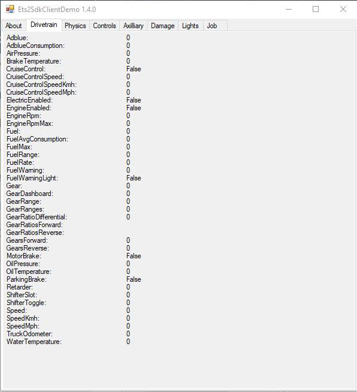

# Requirements

1. Clone this repository to your machine before proceeding with the instructions
2. Navigate to Windows Control Panel | Region and Language | Change date, time and number formats | Additional settings... and change the decimal format to a dot(.) instead of a comma (,) As stipulated [here](https://answers.microsoft.com/en-us/msoffice/forum/msoffice_word-mso_win10-mso_365hp/changing-decimal-separator-from-comma-to-dot/953556fb-00d0-45ad-bd4f-6ca8afa5025a)

---

## Extracting the Telemetry

### SDK made by [nlhans](https://github.com/nlhans/ets2-sdk-plugin)

The SDK is a plugin for ETS. This version of the SDK has been edited to have a button that exports the telemetry to a CSV file with specified location and length of recording.

To install the SDK, navigate to code-mmfreire/SDK/Win64 inside Base Directory and copy the file **ets2-telemetry.dll**. Inside the ETS installation folder (C:/Program Files (x86)/Steam/steamapps/common/Euro Truck Simulator 2/bin/win_x86 for Windows), create a new folder 'plugins' and paste the ets2-telemetry.dll inside it. The path to the telemetry dll file should thus be:

C:/Program Files (x86)/Steam/steamapps/common/Euro Truck Simulator 2/bin/win_x86/plugins/ets2-telemetry.dll

When running the game through Steam and reaching the main menu, a popup will display a message saying there is an advanced SDK installed. Click Ok. This popup will display every time the game is started, and signifies that the SDK is correctly placed in the installation folder.

Navigate to SDK/C#/Ets2SdkClient.Demo/Release and double click the **Ets2SdkClient.Demo.exe**

This will open a window looking like the following:

Keep this application running and start ETS2. Go into the game until you are inside the truck and ready to start recording a drive. When you are ready to start recording, alt-tab out of ETS2 and click the 'Export' button on the SDK application. This will then allow the user to select where the csv file will be saved and what the name of the file will be. Once selected, click OK. A popup stating 'Recording started' will show. Click OK and alt-tab back into ETS2 to start driving. Once done with the drive, exit out of ETS and close the SDK application. The csv file will then be ready to view, inside the location where it was saved.
